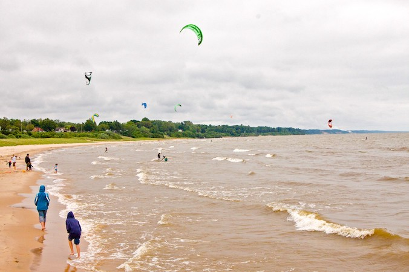
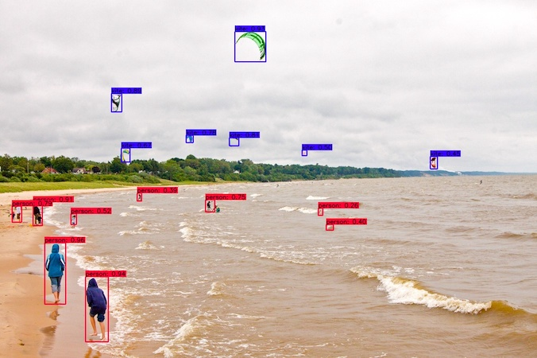

# Sample Vision API ONNX runtime - Docker image

This project provides a simple Flask API which offers object annotation on images with the YOLOv4 API leveraging onnxruntime. 
A Docker file is also provided to build an image of this API.

## Requirements
- Python 3.7 installed or Docker
- Download the YOLOv4 ONNX file [here](https://github.com/onnx/models/raw/master/vision/object_detection_segmentation/yolov4/model/yolov4.onnx) and add it to the `resources` directory

## Get started

### Start the API

Create a Python 3.7 environment and install the API requirements. Move to the `src` directory and start the API with:
```bash
python api.py
```

### Build the Docker image

Alternatively you can build the docker image:

```bash
docker build -t sample-vision-api .
```

### Run the Docker image

Start the image and forward the port 8080.

```bash
docker run --rm -p 8080:8080 sample-vision-api:latest
```

## Use the API

### Annotate objects in an image

To use the API:
```bash
curl -X POST "http://localhost:8080"  -F "file=@kite.jpeg" --output anotated_kite.jpeg
```

## Deploy the API on AI Training

AI Training allows you to deploy Docker images on a managed infrastructure tailored for AI needs, learn more about [AI Training](https://www.ovhcloud.com/fr/public-cloud/ai-training/).

To deploy your API on AI Training with the CLI you first need to build the Docker image. 
Once the image is built you need to push it on a remote repository, you can either create a free account on DockerHub or use a registry directly provided with AI Training.
Let's use the provided registry, from this step forward it is assumed you are logged in with the CLI (`ovhai login`).

First get the registry URL:
```bash
> ovhai registry list

ID TYPE   URL
   SHARED registry.gra.training.ai.cloud.ovh.net/<some-id>
```

Then login to the registry:
```bash
docker login registry.gra.training.ai.cloud.ovh.net/<some-id>
```
You will be prompted for credentials, use the same you used to login with the CLI.

Once logged in you need to retag the image we built locally and then push it:
```bash
docker tag sample-img-api:latest registry.gra.training.ai.cloud.ovh.net/<some-id>/sample-img-api:latest
docker push registry.gra.training.ai.cloud.ovh.net/<some-id>/sample-img-api:latest
```

Finally, just run the image:
```bash
ovhai job run --cpu 4 registry.gra.training.ai.cloud.ovh.net/<some-id>/sample-img-api:latest
```

You can list your jobs with `ovhai job list`. Wait for the job we just submitted to be running. Once running a URL is provided to you to access the API:
```bash
> ovhai job list

ID       STATE   AGE IMAGE                                                           JOB_URL
<job-id> RUNNING 3s  registry.gra.training.ai.cloud.ovh.net/<some-id>/sample-img-api https://<job-id>.job.gra.training.ai.cloud.ovh.net
```

By default the access to the `JOB_URL` is restricted and you can access with an application token. Create an application token:
```bash
> ovhai token create --role read mytoken                                                                                                                                                                                                                                                                          (img-api)
---
appToken: <app-token>
token:
  id: <some-id>
  createdAt: "2021-04-22T15:53:49.993112679Z"
  updatedAt: "2021-04-22T15:53:49.993112679Z"
  name: mytoken
  labelSelector: ""
  version: 1
```
The token we juste created is unscoped and valid for any job. To know more about application token and how to scope them refer to the [documentation](https://docs.ovh.com/gb/en/ai-training/app-token-cli/).

With the new token you can now call the vision API
```bash
export APP_TOKEN=<app-token>
curl -X POST "https://<job-id>.job.gra.training.ai.cloud.ovh.net" -F "file=@kite.jpeg" --output anotated_kite.jpeg -H "Authorization: Bearer $APP_TOKEN"
```

Input: `kite.jpeg`



Output: `anotated_kite.jpeg`



## Adapt the API

There is two main files in the project:
- `api.py` a basic Flask API that reads an image file from the request and return an inferred image as a result
- `inference.py` the inference code including preprocessing and postprocessing steps

To add your own vision API you simply need to redefine the `infer` function in `inference.py`.
This function takes an image input stream that needs to be decoded, and the ONNX runtime session with the trained model loaded.

To create additional routes refer to the [Flask documentation](https://flask.palletsprojects.com/en/1.1.x/)

## Publication/Attribution
* [YOLOv4: Optimal Speed and Accuracy of Object Detection](https://arxiv.org/abs/2004.10934). Alexey Bochkovskiy, Chien-Yao Wang, Hong-Yuan Mark Liao.
* Original models from [Darknet Github repository](https://github.com/AlexeyAB/darknet).

## References
The onnx model along with the inference code is directly extracted from [ONNX models vision YOLOv4](https://github.com/onnx/models/tree/master/vision/object_detection_segmentation/yolov4)

## Contributors
[Christophe Rannou](https://github.com/christophe-rannou)

## License
MIT License